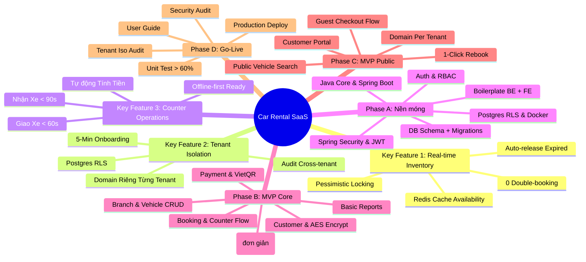
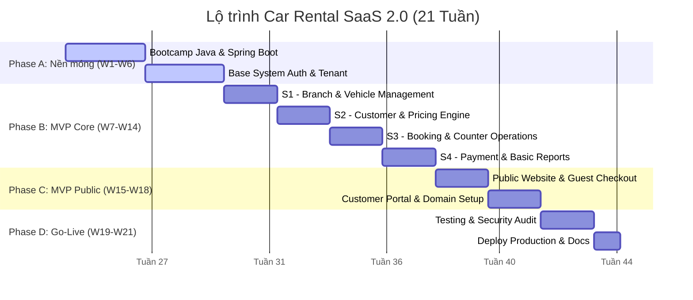

# Sơ đồ trực quan Lộ trình Dự án (Mindmap & Gantt Chart)

**Cập nhật:** 24/06/2026 — Tái cấu trúc theo phân tích thị trường & ưu tiên tính năng.
**Tham chiếu:** [Phân tích chi tiết](analysis/)

---

## 1. Mindmap — Cấu Trúc Sản Phẩm & Key Features



---

## 2. Gantt Chart — Timeline 21 Tuần (4 Phase)



---

## 3. So Sánh Trước / Sau

| Khía cạnh | Roadmap Cũ | Roadmap Mới |
|-----------|-----------|-------------|
| **Tổng thời gian** | 23 tuần | 21 tuần |
| **Có sản phẩm chạy được** | Tuần 23 | Tuần 8 (xe + branch), Tuần 14 (full nội bộ) |
| **Public Booking** | Tuần 22-23 (cuối) | Từ tuần 7, hoàn thiện tuần 18 |
| **Số module nghiệp vụ** | 8 (gồm Vehicle Transfer) | 6 (cắt Transfer, giảm Pricing, giảm Report) |
| **Quality Gate** | 5 mốc chưa rõ ràng | 4 gate cứng, có test case cụ thể |
| **Demo được** | Sau 5 tháng | Sau 2 tháng (Phase A), 3 tháng (Phase B) |

### Tính năng bị cắt / giảm scope

| Tính năng | Hành động | Lý do |
|-----------|-----------|-------|
| **Vehicle Transfer** | CẮT khỏi MVP | Nhà xe <50 xe không dùng, gọi điện thoại là xong |
| **SMS Notification** | CẮT | Tốn chi phí, ROI thấp với nhà xe nhỏ. Giữ Email. |
| **Pricing đa hệ số** | GIẢM còn basePrice × dayMultiplier | Bỏ Season, Holiday. Nhà xe tự chỉnh basePrice. |
| **Report nâng cao** | GIẢM còn 3 báo cáo cơ bản | Doanh thu ngày + Fleet status + Booking hôm nay |
| **Subscription 4 bậc** | GIẢM còn 2 bậc (FREE/PAID) | Phân mảnh gói cước là bài toán scaling |

---

## 4. Milestones Kinh Doanh

| Milestone | Tuần | Demo được gì? | Quyết định |
|-----------|------|---------------|------------|
| **M1: Bootcamp** | W3 | API CRUD có JWT | Team sẵn sàng code? |
| **M2: Base Ready** | W6 | Auth + Tenant Isolation | Đã test cô lập dữ liệu? |
| **M3: Fleet Live** | W8 | Quản lý xe + xem xe trống | **Demo cho 2-3 nhà xe, lấy feedback** |
| **M4: Counter Ops** | W12 | Booking tại quầy + giao/nhận xe | **Cho 1 nhà xe dùng thử** |
| **M5: Payment Done** | W14 | Thanh toán + báo cáo | Sẵn sàng thu tiền thật? |
| **M6: Public Web** | W18 | Web công cộng hoàn chỉnh | **Mở đăng ký dùng thử** |
| **M7: GO-LIVE** | W21 | Production system | **Bắt đầu thu phí** |

---

## Hướng dẫn chèn hình ảnh vào báo cáo

1. Truy cập **[Mermaid Live Editor](https://mermaid.live)**.
2. Dán mã code tương ứng vào ô biên tập.
3. Nhấp vào nút **Download** ở góc dưới cùng bên trái và tải về định dạng **PNG** hoặc **SVG**.
4. Lưu hình ảnh vào dự án của bạn (ví dụ: `docs/assets/mindmap-v2.png` và `docs/assets/gantt-v2.png`).
5. Sử dụng cú pháp sau để hiển thị trong Markdown:

```markdown
.[Sơ đồ tư duy](assets/mindmap-v2.png)
.[Biểu đồ Gantt](assets/gantt-v2.png)
```
